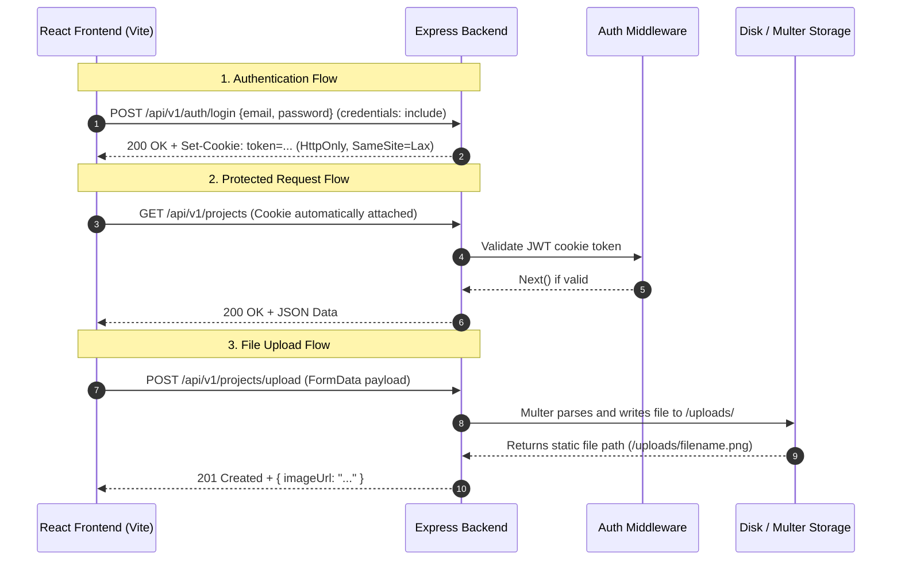

# Full-Stack Integration, Authentication and File Upload Guide

**Author:** Gideon  
**Recipient:** Shem Ndaro  
**Repository:** My Portfolio Fullstack (`SHEMNDARONGUGI/My_Portfolio_Fullstack`)  

---

## 1. System Architecture Flow

The sequence diagram below specifies the exact interaction between the React Vite frontend, Express backend, authentication middleware, and local file storage.



---

## 2. Step 1: Configure Backend CORS and Environment Variables

Start by configuring CORS in the Express backend to allow cross-origin requests and credentials (cookies) from the Vite development server (`http://localhost:5173`).

### 2.1 Backend CORS Middleware Configuration (`server/src/app.ts`)

```typescript
import cors from "cors";

const CLIENT_URL = process.env.CLIENT_URL || "http://localhost:5173";

app.use(
  cors({
    origin: CLIENT_URL,
    credentials: true, // Required for HTTP-only cookies
    methods: ["GET", "POST", "PUT", "PATCH", "DELETE", "OPTIONS"],
    allowedHeaders: ["Content-Type", "Authorization"],
  })
);
```

### 2.2 Frontend API Environment Variable (`client/.env`)

Create or update `client/.env` to set the API endpoint base URL:

```env
VITE_API_BASE_URL=http://localhost:8000/api/v1
```

---

## 3. Step 2: Implement Centralized Frontend API Client

Create a utility function for API requests so that every request includes cookie credentials (`credentials: "include"`) and handles JSON parsing and error checking centrally.

### 3.1 API Client Implementation (`client/src/lib/api.ts`)

```typescript
const API_BASE_URL = import.meta.env.VITE_API_BASE_URL || "http://localhost:8000/api/v1";

export async function apiFetch<T>(
  endpoint: string,
  options: RequestInit = {}
): Promise<T> {
  const config: RequestInit = {
    ...options,
    credentials: "include", // Ensure cookies are sent with cross-origin requests
    headers: {
      ...options.headers,
    },
  };

  // Set application/json content type only when body is not FormData
  if (options.body && !(options.body instanceof FormData)) {
    config.headers = {
      "Content-Type": "application/json",
      ...config.headers,
    };
  }

  const response = await fetch(`${API_BASE_URL}${endpoint}`, config);
  const data = await response.json();

  if (!response.ok) {
    throw new Error(data.message || "An API error occurred");
  }

  return data as T;
}
```

---

## 4. Step 3: Fix Backend Authentication Middleware

Ensure the authentication middleware returns an HTTP 401 status code when the JWT token is missing.

### 4.1 Patched Authentication Middleware (`server/src/middleware/auth.middleware.ts`)

```typescript
import type { RequestHandler } from "express";
import { verifyToken } from "../utils/jwt.js";

export const authenticate: RequestHandler = (req, res, next) => {
  const token = req.cookies?.token;

  if (!token) {
    res.status(401).json({
      success: false,
      message: "Authentication required",
    });
    return;
  }

  try {
    const payload = verifyToken(token);
    res.locals.user = payload;
    next();
  } catch (error) {
    res.status(401).json({
      success: false,
      message: "Invalid or expired token",
    });
  }
};
```

---

## 5. Step 4: Implement React Authentication Context

Set up global authentication state management on the client to handle user session checks, login, and logout.

### 5.1 Auth Context and Provider (`client/src/context/AuthContext.tsx`)

```tsx
import React, { createContext, useContext, useState, useEffect } from "react";
import { apiFetch } from "@/lib/api";

interface User {
  id: string;
  email: string;
  name?: string;
  role: string;
}

interface AuthContextType {
  user: User | null;
  loading: boolean;
  login: (credentials: object) => Promise<void>;
  logout: () => Promise<void>;
}

const AuthContext = createContext<AuthContextType | undefined>(undefined);

export const AuthProvider: React.FC<{ children: React.ReactNode }> = ({ children }) => {
  const [user, setUser] = useState<User | null>(null);
  const [loading, setLoading] = useState<boolean>(true);

  useEffect(() => {
    const checkAuth = async () => {
      try {
        const res = await apiFetch<{ success: boolean; data: User }>("/auth/me");
        setUser(res.data);
      } catch {
        setUser(null);
      } finally {
        setLoading(false);
      }
    };
    checkAuth();
  }, []);

  const login = async (credentials: object) => {
    const res = await apiFetch<{ success: boolean; data: User }>("/auth/login", {
      method: "POST",
      body: JSON.stringify(credentials),
    });
    setUser(res.data);
  };

  const logout = async () => {
    await apiFetch("/auth/logout", { method: "POST" });
    setUser(null);
  };

  return (
    <AuthContext.Provider value={{ user, loading, login, logout }}>
      {children}
    </AuthContext.Provider>
  );
};

export const useAuth = () => {
  const context = useContext(AuthContext);
  if (!context) throw new Error("useAuth must be used within an AuthProvider");
  return context;
};
```

---

## 6. Step 5: Configure Backend File Uploads with Multer

Set up Multer disk storage middleware on the Express server to receive multipart form-data and save uploaded files to an `/uploads` directory.

### 6.1 Upload Middleware Setup (`server/src/middleware/upload.middleware.ts`)

```typescript
import multer from "multer";
import path from "path";

const storage = multer.diskStorage({
  destination: (_req, _file, cb) => {
    cb(null, "uploads/");
  },
  filename: (_req, file, cb) => {
    const uniqueSuffix = Date.now() + "-" + Math.round(Math.random() * 1e9);
    const ext = path.extname(file.originalname);
    cb(null, `${file.fieldname}-${uniqueSuffix}${ext}`);
  },
});

const fileFilter: multer.Options["fileFilter"] = (_req, file, cb) => {
  if (file.mimetype.startsWith("image/")) {
    cb(null, true);
  } else {
    cb(new Error("Only image files are allowed"));
  }
};

export const upload = multer({
  storage,
  limits: { fileSize: 5 * 1024 * 1024 }, // 5MB limit
  fileFilter,
});
```

### 6.2 Serve Static Files (`server/src/app.ts`)

Register express static middleware to serve uploaded assets publicly:

```typescript
import express from "express";
import path from "path";

app.use("/uploads", express.static(path.join(process.cwd(), "uploads")));
```

### 6.3 Register Upload Endpoint (`server/src/features/projects/project.routes.ts`)

```typescript
import { upload } from "../../middleware/upload.middleware.js";
import { authenticate } from "../../middleware/auth.middleware.js";
import { authorize } from "../../middleware/role.middleware.js";

router.post(
  "/upload",
  authenticate,
  authorize("admin"),
  upload.single("image"),
  (req, res) => {
    if (!req.file) {
      res.status(400).json({ success: false, message: "No file uploaded" });
      return;
    }
    const fileUrl = `${req.protocol}://${req.get("host")}/uploads/${req.file.filename}`;
    res.status(201).json({
      success: true,
      message: "File uploaded successfully",
      url: fileUrl,
    });
  }
);
```

---

## 7. Step 6: Implement Frontend File Upload Component

Build the frontend component using standard HTML input elements and `FormData`. Do not explicitly specify `Content-Type: multipart/form-data` in header options; the browser must automatically set the `Content-Type` header along with the required boundary string.

### 7.1 Upload Component (`client/src/components/ProjectForm.tsx`)

```tsx
import React, { useState } from "react";
import { apiFetch } from "@/lib/api";

export function ProjectForm() {
  const [title, setTitle] = useState("");
  const [description, setDescription] = useState("");
  const [selectedFile, setSelectedFile] = useState<File | null>(null);
  const [preview, setPreview] = useState<string | null>(null);
  const [isUploading, setIsUploading] = useState(false);

  const handleFileChange = (e: React.ChangeEvent<HTMLInputElement>) => {
    if (e.target.files && e.target.files[0]) {
      const file = e.target.files[0];
      setSelectedFile(file);
      setPreview(URL.createObjectURL(file));
    }
  };

  const handleSubmit = async (e: React.FormEvent) => {
    e.preventDefault();
    if (!selectedFile) return alert("Select an image file first");

    setIsUploading(true);
    try {
      const formData = new FormData();
      formData.append("image", selectedFile);
      formData.append("title", title);
      formData.append("description", description);

      const result = await apiFetch<{ success: boolean; url: string }>("/projects/upload", {
        method: "POST",
        body: formData,
      });

      alert(`File uploaded successfully: ${result.url}`);
    } catch (err) {
      alert("Upload failed: " + (err as Error).message);
    } finally {
      setIsUploading(false);
    }
  };

  return (
    <form onSubmit={handleSubmit} className="p-6 bg-slate-900 text-white rounded-xl max-w-md space-y-4">
      <h2 className="text-xl font-bold">Add New Project</h2>
      
      <input
        type="text"
        placeholder="Project Title"
        value={title}
        onChange={(e) => setTitle(e.target.value)}
        className="w-full p-2 bg-slate-800 rounded border border-slate-700"
      />

      <textarea
        placeholder="Project Description"
        value={description}
        onChange={(e) => setTitle(e.target.value)}
        className="w-full p-2 bg-slate-800 rounded border border-slate-700"
      />

      <div className="space-y-2">
        <label className="block text-sm text-gray-400">Project Thumbnail</label>
        <input
          type="file"
          accept="image/*"
          onChange={handleFileChange}
          className="w-full text-sm text-gray-400 file:mr-4 file:py-2 file:px-4 file:rounded-md file:border-0 file:bg-indigo-600 file:text-white hover:file:bg-indigo-500"
        />
      </div>

      {preview && (
        
      )}

      <button
        type="submit"
        disabled={isUploading}
        className="w-full py-2 bg-indigo-600 hover:bg-indigo-500 font-semibold rounded-lg transition"
      >
        {isUploading ? "Uploading..." : "Submit Project"}
      </button>
    </form>
  );
}
```

---

## 8. Verification Steps

1. Verify Express CORS settings include `credentials: true` and the correct origin URL.
2. Confirm all API requests from the frontend include `credentials: "include"`.
3. Test unauthenticated requests to protected endpoints to ensure HTTP 401 is returned.
4. Test file uploads via `FormData` and verify the file is stored in `server/uploads/` and served statically.
